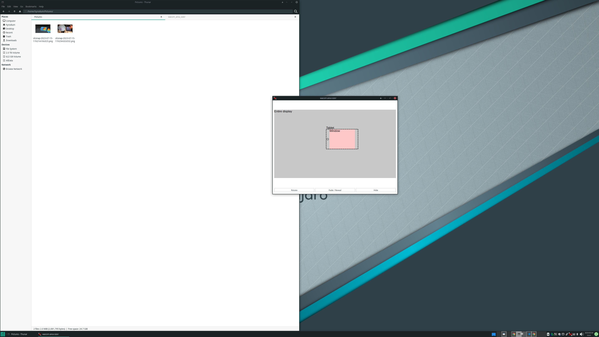

# wacom-area-sizer


I love the Wacom pen tablet, but it does not replace my mouse.
I want to illustrate figures in a specific area, not in the entire display.
`wacom-area-sizer` enables us to set up a drawing area with a simple GUI.

# Install

Installation with [rye](https://github.com/astral-sh/rye):

```
git clone https://github.com/hyrodium/wacom-area-sizer
cd wacom-area-sizer
rye install .
```

Prerequisite:

- `xsetwacom`
- `xinput`
- `xrandr`

# Usage

After installation, you can use `was` command.

```
was
```

This command will open a new window like this:



[📸🎬📺 Demo on YouTube! 📽️🎞️📹](https://www.youtube.com/watch?v=HCX8so2dX_U)

The area of the window will be the canvas area of the Wacom tablet.
You can change the size and position of the canvas by dragging the window.
You can hide the window by

- Pushing `Esc` key.
- Click `Hide` button in the window.
- Click the icon in the taskbar.

After hiding, you can reopen the window by clicking the icon in the taskbar.

# Uninstall

```
rye uninstall wacom-area-sizer
```
